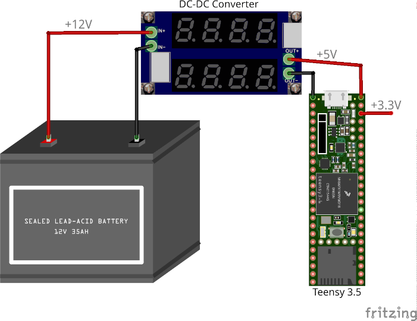
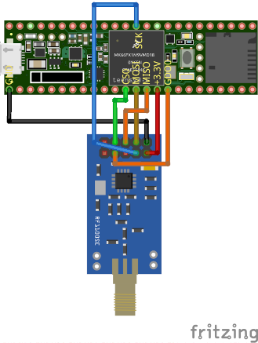
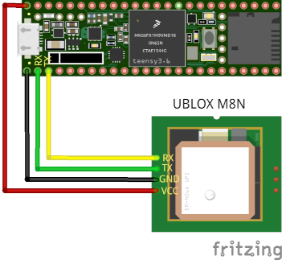

# Introduction

## What is MicronetToNMEA

MicronetToNMEA is a Teensy/Arduino based project aimed at building a
cheap NMEA/Micronet bridge. The initial purpose of this project was to
understand Micronet wireless protocol and to be able to record wind and
speed from Raymarine’s TackTick devices on a PC or a tablet. The
understanding of the protocol went so well that MicronetToNMEA is now
doing a lot more. It can:

- Send or receive a NMEA stream to or from your PC with data on depth,
  water speed, wind, magnetic heading, GNSS positioning, speed, time,
  etc.

- Send Heading data from the LSM303 navigation compass to your TackTick
  displays.

- Send GNSS data to your TackTick displays and to your PC.

- Send navigation data from your PC (OpenCPN, qtVlm, avnav, etc.) to
  your TackTick displays.

## What is NOT MicronetToNMEA

MicronetToNMEA is not waterproof and more generally not reliable. All
electronics used in this project are made for hobbyist and are all but
robust. In the brutal, wet and salty environment of a boat, it may fail
very quickly. So be careful that MicronetToNMEA should not be used as
primary navigation tool. Also note that Micronet wireless protocol has
been reverse engineered and that some of its aspects are not yet
properly understood. Worse, some understandings we think to be correct
might be false in some circumstances. If you need state of the art and
reliable navigation devices, just go to your nearest Raymarine/TackTick
reseller.

## Contributors

- Ronan Demoment : Main author

- Dietmar Warning : LSM303 drivers & Bugfixes

- [j-lang](https://github.com/j-lang) : UBLOX M8N initialization code

- Contributors of YBW forum’s Micronet thread : [Micronet
  Thread](https://forums.ybw.com/index.php?threads/raymarines-Micronet.539500/)

# Needed hardware and software

## Required hardware

To work properly, MicronetToNMEA needs at minimum a Teensy 4.0 board and
a CC1101 based breakout board.

### Teensy micro-controller

Teensy board has been chosen as the core micro-controller of the
MicronetToNMEA system. This choice has been led by one main reason : the
author had one available when he started investigating Micronet
protocol. That’s indeed a good reason but with time, this board has also
proven to be pretty well adapted :

- It is small

- Teensy software stack is rich and stable

- It has a lot of highly configurable peripherals

The main drawback of Teensy 4.0 is its price : it is on the high side of
MCU boards.

In theory, you can port MicronetToNMEA SW to any 32bit Arduino
compatible board. Practically, this might be a different story. Several
people got into troubles trying to use ESP32 boards. While this is
technically feasible, Arduino’s library implementation between Teensy &
Esp32 board can be slightly different in some sensitive areas like
interrupt handling. This makes porting complex on a software which needs
\<100us precise interrupt triggers.

Teensy boards can be ordered here : <https://www.pjrc.com/teensy/>

### CC1101 board

CC1101 is mandatory to MicronetToNMEA. It is the IC which enables RF
communication with Micronet/TackTick devices. CC1101 breakout boards are
cheap and can be found easily on internet. Be careful when ordering this
board since it is designed for a specific range of frequencies (filter
and antenna), even if it is announced to support 434 & 868MHz. The IC
can support several frequencies, but not the antenna filter.
MicronetToNMEA needs a board designed for 868/915MHz usage. Ordering the
wrong board would dramatically reduce operating distance between
MicronetToNMEA and TackTick devices. Here is an example of a suitable
board: [868MHz CC1101
module](https://www.amazon.fr/laqiya-cc1101-868-MHz-Transmission-Antenne-Transceiver/dp/B075PFQ57G)

These low-cost boards are often delivered without any documentation,
especially pin-out description. In that case CC1101 data-sheet might
help : [CC1101 datasheet](https://www.ti.com/lit/ds/symlink/cc1101.pdf)

## Optional hardware

You can add optional HW to MicronetToNMEA to enhance its capabilities.

### NMEA0183 GNSS

If you want to connect a GNSS/GPS to MicronetToNMEA, there is only one
important point: it must output localization data on a RS232 link using
NMEA0183 format. An example of cheap GNSS which fits the need is the
UBLOX NEO-M8N. The NEO-M8N can directly output NMEA stream to its serial
output. Avoid too cheap offers from unknown HW sources, this might be
counterfeit hardware.

### NMEA0183 AIS

If you already have an AIS with a NMEA0183 output on your boat you can
use it as a GNSS source. MicronetToNMEA also have the capability to
forward AIS data to the PC/Tablet. Be careful that AIS outputs are not
3.3V and that you will likely need a level shifter or a RS422/485
transceiver. A signal above 3.6V will burn your Teensy input.

### LSM303AGR, LSM303DLHC or LSM303DLH navigation compass breakout board

Connected to Teensy I2C bus, this IC will allow getting magnetic
heading. MicronetToNMEA automatically detects the presence and type of
LSM303AGR/DLHC/DLH on its I2C bus.

### Wireless serial devices for NMEA link (BT or WiFi)

You can connect HC-06 bluetooth transceiver to MicronetToNMEA serial
NMEA port to easily get a wireless connection to a PC/Tablet. Connecting
an ESP8266 based Serial to WiFi board (Wemos, nodeCPU etc.) allow you to
establish an WiFi access point and a client connection to navigation
software like OpenCPN.

Note that MicronetToNMEA does not configure these boards, it is up to
you to configure them before connecting it.

## Required software

### Arduino IDE (required)

Arduino IDE provides gcc-arm compiler and all libraries necessary for
MicronetToNMEA. This is the first software you must install.

### Teensyduino (required)

Teensyduino is an extension to Arduino IDE which add full support to all
Teensy’s board. It must be installed on top of Arduino IDE to enable
compilation for Teensy targets.

## Optional software

### Visual Studio Code and PlatformIO (optional)

If you plan to do more than just compile MicronetToNMEA’s code, you
probably need a more serious IDE. [Visual Studio
Code](https://code.visualstudio.com/) is a open source IDE made by
Microsoft with plenty of features which will highly improve your
productivity. Coupled to [PlatformIO](https://platformio.org/) plugin it
can handle project for Teensy boards. MicronetToNMEA includes
configuration files for PlatformIO which will help you to quickly setup
your environment.

Note that you don’t need Arduino IDE or Teensyduino if you use Visual
Studio Code and PlatformIO.

# Compilation

## With Arduino IDE

Here are the steps to compile MicronetToNMEA with Arduino IDE:

- Get the source code from MicronetToNMEA repository
  (<https://github.com/Rodemfr/MicronetToNMEA>)

- Double-click on src/src.ino. This should open Arduino IDE.

- In Arduino IDE, select the appropriate Teensy board with menu
  “Tools-\>Board-\>Teensyduino-\>Teensy4.0”

- Go to menu “Tools-\>Manage Libraries...” and install TeensyTimerTool
  library

- Click on “Verify” button in the button bar, this should compile the
  project without error.

- Connect your Teensy board onto USB port of your PC and Click “Upload”
  button to upload MicronetToNMEA binary into Teensy flash memory

## With Visual Studio Code and PlatformIO

Here are the steps to compile MicronetToNMEA with Visual Studio Code :

- Install Visual Studio Code from Microsoft website :
  <https://code.visualstudio.com>

- Start Visual Studio Code and install PlatformIO extension. Note that
  you might have to install *python3-distutils* package under Linux for
  the installation to be successful.

- Open MicronetToNMEA base folder with menu *"File-\>Open Folder"*. The
  base folder is the one with *platformio.ini* file.

- At the first opening, PlatformIO plugin will download and install
  Teensy toolchain. This can take a while since there is more than 1Gb
  of data to download from network.

- Once PlatformIO is ready, you can compile MicronetToNMEA by pressing
  *SHIFT-CTRL-B*.

- To upload the compiled binary to the Teensy, press *SHIFT-CTRL-U*.

Your project should compile now.

## Compile time configuration

By default, MicronetToNMEA is configured for a specific HW layout. This
means that it is configured to be connected through specific SPI, I2C or
GPIO pins to various boards. This configuration can be changed to some
extent to adapt your own needs. The file bearing this configuration is
“BoardConfig.h”. Note that no coherency check is made in the software,
it is your responsibility to provide a reachable configuration (i.e. not
to connect SPI wires to non SPI capable pins). Table
<a href="#table:configswitches" data-reference-type="ref"
data-reference="table:configswitches">[table:configswitches]</a> lists
all available switches and their meaning.

| **Compile Switch**       | **Description**                                                                                                                                                                  |
|:-------------------------|:---------------------------------------------------------------------------------------------------------------------------------------------------------------------------------|
| FREQUENCY_SYSTEM         | Defines which frequency range is used by your Micronet network (0=868MHz, 1=915MHz)                                                                                              |
| COMPASS_I2C              | Sets the I2C bus to which the navigation compass (i.e. LSM303) is connected. Defined as per “Wiring” library definition (Wire, Wire1, etc.)                                      |
| CS0_PIN                  | Defines SPI Chip Select line connected to RF IC                                                                                                                                  |
| MOSI_PIN                 | Defines MOSI pin of SPI bus connected to RF IC                                                                                                                                   |
| MISO_PIN                 | Defines MISO pin of SPI bus connected to RF IC                                                                                                                                   |
| SCK_PIN                  | Defines SCK pin of SPI bus connected to RF IC                                                                                                                                    |
| GDO0_PIN                 | Defines GDO0 pin of SPI bus connected to RF IC                                                                                                                                   |
| CONSOLE                  | Defines on which serial port is connected the external console (SerialUSB, Serial1, Serial2, etc.)                                                                               |
| GNSS                     | Defines on which serial port is connected the NMEA GNSS (Serial, Serial1, Serial2, etc.)                                                                                         |
| GNSS_BAUDRATE            | Defines GNSS UART baud-rate                                                                                                                                                      |
| GNSS_RX_PIN              | Defines serial RX pin connected to NMEA GNSS TX pin                                                                                                                              |
| GNSS_TX_PIN              | Defines serial TX pin connected to NMEA GNSS RX pin                                                                                                                              |
| AIS                      | Defines which serial port is connected to the AIS receiver                                                                                                                       |
| AIS_BAUDRATE             | Defines baud rate of USB serial converter                                                                                                                                        |
| AIS_RX_PIN               | Defines serial RX pin connected to AIS receiver                                                                                                                                  |
| PLOTTER                  | Defines which serial port is connected to the plotter                                                                                                                            |
| PLOTTER_BAUDRATE         | Defines baud rate of plotter serial connection                                                                                                                                   |
| PLOTTER_RX_PIN           | Defines serial RX pin connected to plotter TX pin                                                                                                                                |
| PLOTTER_TX_PIN           | Defines serial TX pin connected to plotter RX pin                                                                                                                                |
| NAV_SOURCE_LINK          | Defines where navigation data is coming from (related to RMB sentences). See Section <a href="#supportednmeasentences" data-reference-type="ref"                                 
                            data-reference="supportednmeasentences">5.1.7</a> for more details on possible values.                                                                                            |
| GNSS_SOURCE_LINK         | Defines where positioning data is coming from (related to RMC, GGA, VTG sentences). See Section <a href="#supportednmeasentences" data-reference-type="ref"                      
                            data-reference="supportednmeasentences">5.1.7</a> for more details on possible values.                                                                                            |
| WIND_SOURCE_LINK         | Defines where wind data is coming from (related to MWV sentence). See Section <a href="#supportednmeasentences" data-reference-type="ref"                                        
                            data-reference="supportednmeasentences">5.1.7</a> for more details on possible values.                                                                                            |
| DEPTH_SOURCE_LINK        | Defines where depth data is coming from (related to DPT sentence). See Section <a href="#supportednmeasentences" data-reference-type="ref"                                       
                            data-reference="supportednmeasentences">5.1.7</a> for more details on possible values.                                                                                            |
| SPEED_SOURCE_LINK        | Defines where speed data is coming from (related to SPD, LOG sentences). See Section <a href="#supportednmeasentences" data-reference-type="ref"                                 
                            data-reference="supportednmeasentences">5.1.7</a> for more details on possible values.                                                                                            |
| VOLTAGE_SOURCE_LINK      | Defines where voltage data is coming from (related to XDR sentence). See Section <a href="#supportednmeasentences" data-reference-type="ref"                                     
                            data-reference="supportednmeasentences">5.1.7</a> for more details on possible values.                                                                                            |
| SEATEMP_SOURCE_LINK      | Defines where temperature data is coming from (related to STP sentence). See Section <a href="#supportednmeasentences" data-reference-type="ref"                                 
                            data-reference="supportednmeasentences">5.1.7</a> for more details on possible values.                                                                                            |
| COMPASS_SOURCE_LINK      | Defines where heading data data is coming from (related to HDG sentence). See Section <a href="#supportednmeasentences" data-reference-type="ref"                                
                            data-reference="supportednmeasentences">5.1.7</a> for more details on possible values.                                                                                            |
| SOG_COG_FILTERING_ENABLE | If set to 1, MicronetToNMEA will filter SOG and COG values before sending them to Micronet displays or to NMEA_EXT link.                                                         |
| SOG_COG_FILTERING_DEPTH  | Sets the strength of the SOG/COG filtering, if enabled. Minimum value is 1 (no filtering), maximum reasonable value is 20 (average on 20 samples). Default is set to 7.          |
| EMULATE_SPD_WITH_SOG     | If set to 1, MicronetToNMEA will copy SOG value received from GNSS to SPD on the Micronet network. Not to be used if you have water speed measurements coming from T121 or NMEA. |

# Installation

Teensy board must be connected to other boards with the same scheme than
you have defined in “BoardConfig.h”. No check is made by MicronetToNMEA
software to verify that your configuration is matching your actual
connections. You must carefully verify that you properly connected the
various devices since wrong connections can possibly damage your
hardware, especially with respect to power supply connections which are
mixing 3.3 & 5V levels.

## Power supply

The first and most important connection to build is the power supply.
You have two options there, you can either :

- Power the system via USB

- Power the system using external DC power source

### Power via USB

This is the most straightforward way to power the system: just plug an
USB cable in the Teensy connector and it will be powered by the
connected PC. Teensy board is equipped with a voltage regulator which
provides 3.3V. This 3.3V voltage can be used to power other boards of
the system. Be careful that USB 2.0 limits 5V output current to 500mA,
but you should be even more careful since Teensy’s regulator recommends
not to exceed 250mA for 3.3V. So you must take care that your system
does not exceed these limits. As an example, table
<a href="#table:boardconsumption" data-reference-type="ref"
data-reference="table:boardconsumption">4.1</a> shows maximum current
values for various boards.

| Board                      | Supply voltage | Max current | Comment                                 |
|:---------------------------|:--------------:|:-----------:|:----------------------------------------|
| Teensy 3.5                 |       5V       |    50mA     | CPU running at 120MHz                   |
| Teensy 3.6                 |       5V       |    80mA     | Input not 5V tolerant                   |
| Teensy 4.1                 |       5V       |    100mA    | Input not 5V tolerant                   |
| CC1101                     |      3.3V      |    40mA     | RF at 868MHz                            |
| NEO M8N GNSS               |       5V       |    45mA     | IOs are 3.3V                            |
| LSM303DLH(C)               |      3.3V      |    10mA     | Unspecified in datasheet, value assumed |
| HC06 Bluetooth transceiver |      3.3V      |    40mA     | Peak during pairing                     |
| Serial WiFi (ESP8266)      |       5V       |    150mA    | 80mA average, upto 400mA peak           |

Current consumption of typical boards

USB powering is especially useful when you plan to output NMEA through
USB-serial. In this case, the connected PC/Tablet will provide power to
the system and when MicronetToNMEA is not needed anymore, just unplug
the USB cable to power-off the system.

### Power with an external DC source

While USB powering is easy to setup, it is not a common source of power
in a boat. It is more usual to get two wires with an unstable battery
voltage between 11V and 15V. In that case, you will need a voltage
regulator or a DC-DC converter which will be used to produce a stable 5V
for the system. This 5V source can then be connected to the Vin pin of
Teensy. The on-board regulator will then produce 3.3V from this input.
When Vin pin is connected to an external source of power, you must not
connect an USB cable to avoid short circuit between Vin and Vusb which
are connected together on Teensy by default. The Vin pin can handle
voltages from 3.6 to 6V but it is strongly recommended to use 5V here.
This way, if you accidentally connect a USB cable while powering Vin,
there will be no heavy short circuit.

<figure id="figure:dcpower">

<figcaption>Powering Teensy with a DC-DC converter</figcaption>
</figure>

## Connecting CC1101

CC1101 uses 3.3V voltage so you can connect Teensy’s 3.3V & GND pins to
CC1101’s VCC & GND. MOSI(SI), MISO(SO), CS0 and GD0 must be connected as
per your BoardConfig.h definitions. Note that GDO2 isn’t used by
MicronetToNMEA and doesn’t need to be connected to Teensy. Figure
<a href="#figure:cc1101" data-reference-type="ref"
data-reference="figure:cc1101">4.2</a> shows how to connect CC1101 with
the default configuration.

<figure id="figure:cc1101">

<figcaption>Connecting Teensy and CC1101</figcaption>
</figure>

## Connecting LSM303

LSM303DLH(C) uses 3.3V voltage so you can connect Teensy’s 3.3V & GND
pins to CC1101’s VCC & GND. In addition SDA & SCL must be connected as
per your BoardConfig.h definitions. Note that DRDY, I1 & I2 don’t need
to be connected. Figure
<a href="#figure:lsm303" data-reference-type="ref"
data-reference="figure:lsm303">4.3</a> shows how to connect LSM303DLH(C)
with the default configuration.

<figure id="figure:lsm303">

<figcaption>Connecting Teensy to LSM303</figcaption>
</figure>

## Connecting GNSS

Unlike CC1101 or LSM303DLH(C), GNSS/GPS boards are often requiring 5V
VCC as power voltage. So you have to connect it directly to DC-DC
Converter’s output. You should check however that your GNSS board is not
3.3V powered, in which case you should use one of Teensy 3.3V pin. TX
and RX pins must then be connected respectively on RX and TX of Teensy’s
UART. The recommended UBLOX M8N module has an internal regulator to 3.3V
on board, so you can connect GNSS directly even if it is using 5V supply
voltage. This situation may be different for other GNSS modules.

Figure <a href="#figure:gnss" data-reference-type="ref"
data-reference="figure:gnss">4.4</a> shows how to connect GNSS for the
default configuration.

<figure id="figure:gnss">

<figcaption>Connecting Teensy and GNSS</figcaption>
</figure>

MicronetToNMEA can connect to a wide variety of GNSS. You just have to
configure the GNSS with the correct parameters before connecting it.
GNSS has to output an NMEA compatible stream at the same bit-rate than
specified in BoardConfig.h. MicronetToNMEA can automatically configure
the GNSS if it is a UBLOX Neo M8N. Just enable GNSS_UBLOXM8N option in
BoardConfig.h.

GNSS should output the following sentences :

- GGA : Position

- RMC : Time

- VTG : Track and speed

## Connecting wireless serial modules

When MicronetToNMEA is configured to send its console and/or NMEA output
to a standard wired UART (i.e not USB), you can consider connecting a
HC-06 Bluetooth transceiver or an Serial WiFi board to easily get
wireless connectivity to your PC/Tablet. Both boards are powered with 5V
but can handle 3.3V signals. Only VCC, GND, RXD & TXD need to be
connected. Figure <a href="#figure:hc06" data-reference-type="ref"
data-reference="figure:hc06">4.5</a> shows how to connect e.g. HC-06
with the default configuration.

<figure id="figure:hc06">

<figcaption>Connecting Teensy and HC-06</figcaption>
</figure>

As for the GNSS, MicronetToNMEA does not configure HC-06 itself. It is
your responsibility to configure HC-06 properly (i.e. with parameters
matching BoardConfig.h) prior to connecting it to Teensy.

## Recommendations

### RF performance

Micronet devices cannot legally exceed a handful of milliwatts of
transmit power. As a consequence the operational range will hardly
exceed 15-20m. It is important not to put metal objects or panels
between your various devices. This would dramatically reduce of the
operational range of MicronetToNMEA. You should also be careful if you
are racing and using carbon sails. If the sails are between your wind
vane and MicronetToNMEA, you will likely not receive wind data. Carbon
disturbs RF transmissions. It is generally considered not to be a good
idea to use wireless electronics in a carbon boat or with carbon sails.
Fibreglass attenuates only a little the signal, so it is safe to attach
your device inside a GRP hull.

The quality of CC1101’s antenna is critical to maximize RF performance
and operational range. Antennas provided with low cost breakout boards
are often designed to be small at the cost of RF performance. An easy
way to get a good quality antenna is to use a simple electrical wire
with the adequate length (quarter wavelength: 86.5mm for 869MHz or 82mm
for 915MHz). With such an antenna you can reach a very good operating
range. Wire antenna also have the interesting feature of beeing flexible
so that you can orient them to maximize wind reception (use *"Test RF
quality"* menu for that).

### Magnetic compass disturbances

If your are using LSM303 to get magnetic heading, it is very important
to put your MicronetToNMEA assembly far from other electrical devices,
especially those carrying a bit of power. This can highly disturb
magnetic compass. As an example, a running 24" TV monitor can deviate
the compass by 20° at 50cm and still a few degrees at 1m. Also, metal
must be avoided : it deviates magnetic field. The bigger the piece of
metal is the farthest you should put your device. In a boat you should
avoid the keel, batteries and the inboard engine. At a smaller scale,
you should keep LSM303 board away from DC-DC converter if you can.

### Magnetic compass calibration

An electronic compass must be properly calibrated to produce good
values. The theory tells us that a perfect calibration would need to
have your device attached in its final position and to spin your boat
around the 3 axis. This is generally not something we want to do. To
achieve a good calibration with less complex operations, the best is to
calibrate MicronetToNMEA outside your boat, far from any metal or
electronic device. You should also keep it as far as possible of its
power supply. Once calibrated, get it back to your boat and fix it in a
proper place, following the above recommendations. This should give good
results.

### CPU frequency and power consumption

The latest Teensy boards have powerful CPUs running up to 600MHz. This
power has a cost : power consumption. MicronetToNMEA doesn’t need so
much power so it is advised to reduce the CPU speed to 24MHz. It will
significantly reduce power consumption. On a system with a Teensy
4.0@24MHz, a NEO M8M GNSS, a HC-06 Bluetooth transceiver, a CC1101, a
LSM303DLH and a oversized 5V DC-DC converter, the complete power
consumption at 12V connector is averaging around 800mW. With an
optimized 3.3V DC-DC, this can be as low as 500mW.

# Usage

## Configuring MicronetToNMEA

### Connecting to the console

To be able to configure MicronetToNMEA, you must have access to the
configuration menu displayed on the serial console. By default, this
console is connected to the USB serial port of Teensy. So you just have
to find a terminal software to connect to it. A good open source
terminal is [Tera Term](http://www.teraterm.org/). Note that when using
Teensy USB connection, you can use any baud-rate on PC side, this as no
real effect.

At the first power-up, before having configured MicronetToNMEA, console
should go directly to the configuration menu. If this is not the case,
it means that a configuration as already been written in EEPROM and that
MicronetToNMEA has automatically switched to "NMEA conversion mode". In
this case, you just have to press *\<ESC\>* key to come back to the
configuration menu.

The menu should look like this :

    *** MicronetToNMEA ***

    0 - Print this menu
    1 - General info on MicronetToNMEA
    2 - Scan Micronet networks
    3 - Attach converter to a network
    4 - Start NMEA conversion
    5 - Scan surrounding Micronet traffic
    6 - Calibrate RF XTAL
    7 - Calibrate compass
    8 - Test RF quality

### Attaching your Micronet network to MicronetToNMEA

We need to identify your Micronet network for MicronetToNMEA to be able
to recognize it and to ignore other networks that may be in you
vicinity. You will typically find several networks when in a marina with
many sailing boats. To identify your network, you have to power-up your
Micronet display and to ensure that your master device, the one you used
to power-up the network, is close to MicronetToNMEA, let say, 2 or 3
meters maximum. Once done, enter *"2 - Scan Micronet networks"* menu by
pressing 2 in the console. This will start a five second scanning
sequence which listens to every network in the area. At the end of this
sequence, every network found will be listed in the console. If there
are several networks, they are listed in decreasing order of power.

    Network - 83038F54 (very strong)
    Network - 810278A6 (low)

Yours is very likely at the top of the list with mention "very strong".
This is the signal strength. For each network you get a hexadecimal
number which is the so called "Network ID". Write it on a piece of paper
(*83038F54* in our example). Now enter menu *"3 - Attach converter to a
network"* by pressing 3, and type your network ID when requested. This
will attach MicronetToNMEA to your Micronet network. Once done,
MicronetToNMEA will save this value to EEPROM and will remember it. You
don’t need to do this operation at each start-up. Now that
MicronetToNMEA is attached, it will automatically go to NMEA conversion
mode at the next power-up.

### Calibrating CC1101 RF XTAL

CC1101 board uses a crystal to generate its frequencies. Crystal
frequency is more or less precise and needs to be calibrated for CC1101
to generate exactly the expected frequency. Each crystal needs to be
calibrated independently. This calibration is very important because it
directly influences the range performance of the RF system (i.e. the
maximum distance at which MicronetToNMEA can detect other devices). When
you buy a TackTick device, this calibration has already been done at
factory. But when you build a MicronetToNMEA system, you need to do it
yourself.

Menu *"6 - Calibrate RF XTAL"* does this calibration. Enter it by
pressing key 6. A text will explain the procedure : power-up your
Micronet network and place the master device (the one you used to
power-up the network) very close to MicronetToNMEA (less than one
meter). Now press any key and let the calibration proceed. During 2
minutes, you will see dots and stars appear on the console looking like
this :

    ...................*.**********************.**.....................................

Each character represents a tested frequency where MicronetToNMEA
verifies if it receives data from the Master device. A dot means that
nothing was received, a star means that a message was received. The
center of the starred area is the best reception frequency and
MicronetToNMEA will use this one to get the best RF performance. Your
crystal is calibrated. At the end of the procedure, you will be asked if
you want to save the new calibration value to EEPROM. Just answer yes
and your calibration will be done once for all.

### Calibrating navigation compass

Navigation compass needs to be calibrated on its 3 axis to produce
correct heading measurements. An uncalibrated compass will give totally
wrong values and not just by a few degrees.

The base principle of calibration consists in determining the minimum
and maximum values of earth’s magnetic field onto each of the three axis
of the sensor. This way, heading calculation will be able to remove any
bias on the 3 axis. This bias is produced by the LSM303 itself, but also
by surrounding electronics (Teensy, GNSS, etc.).

Before starting calibration, you must first prepare your environment as
explained in
<a href="#compass-recommendations" data-reference-type="ref"
data-reference="compass-recommendations">4.6.2</a>. Once ready, you can
enter menu *"7 - Calibrate compass"*.

This menu will produce a permanent output of calibration values looking
like this :

    (0.2 -0.35 -0.17)
    [0.20 0.98] [0.12 1.0] [-0.25 0.99]

The first line gives the current magnetic field on each of the three
axis : X, Y and Z. The second line gives the two calibration parameters
for each axis : center value ((max + min) / 2) and axis amplitude (max -
min).

Your objective for a successful calibration is to maximize/minimize
readings on each axis. To do this, you must first choose one axis and
then rotate your MicronetToNMEA device until this axis is aligned with
earth’s magnetic field vector. You should see the corresponding reading
on the first line maximum (or minimum). You must repeat this operation a
second time for the same axis but for opposite values (i.e. you must
minimize the reading). Each time you reach the maximized/minimized
value, you don’t need to do anything, MicronetToNMEA will memorize the
min/max values for each axis.

Note that the magnetic field vector is pointing more or less to the
north, but not horizontally, it is pointing somewhat down to earth in
north hemisphere and up to the sky in south hemisphere.

You must reproduce this operation for all 3 axis to complete
calibration. A successful calibration should lead to very close
amplitude values for all 3 axis, on the second line. Center values can
however be very different.

Once achieved, just press *\<ESC\>* and tell MicronetToNMEA to save the
value in EEPROM. Your compass is calibrated.

### Testing RF performance

Menu *"8 - Test RF quality"* will help you to evaluate the quality of
the connection with each Micronet devices individually. This will be
critical to fix your MicronetToNMEA assembly at the right place in your
boat. When entering this menu, you will see the list of devices of your
network with a indicator of the connection quality :

    81071e60 LNK=7.6 NET=9 Dual Display [M]
    01071e77 LNK=7.2 NET=9 Hull
    81037082 LNK=6.2 NET=7 Dual Display
    83037737 LNK=6.2 NET=6 Wind Display
    830ab252 LNK=6.2 NET=9 Wind Display

*LNK* indicates the strength of the signal of the device as received by
MicronetToNMEA.

*NET* indicates the strength of the signal of the Master as received by
the device.

A value of 9 is considered excellent while a value below 3 is low. *LNK*
can be used to find the best place for MicronetToNMEA, while *NET* is
useful to check if every device is properly receiving master’s messages.
The list is refreshed every second. The problematic device is generally
the wind transducer which is shadowed by the mast. Placing
MicronetToNMEA and your master display outside this shadow will ensure a
good wind reception.

### Starting NMEA conversion

Menu *"4 - Start NMEA conversion"* actually start Micronet/NMEA
conversion as suggested by the name. Once you enter in this mode
MicronetToNMEA will output NMEA sentences to the NMEA_EXT link. By
default, NMEA_EXT is routed to the same serial link than the console
(USB serial). It means that you will immediately see NMEA sentences
beeing written onto console. Additionnaly, MicronetToNMEA also decodes
any incoming NMEA sentence from NMEA_EXT serial and transmits it to your
Micronet network. You need to be in this mode to see decoded GNSS or
NMEA data displayed onto your Micronet displays. You also need to be in
this mode for the configuration parameters modified onto your Micronet
displays to be memorized by MicronetToNMEA (e.g. speed factor, sounder
offset, etc.). If attached to a network, MicronetToNMEA will
automatically switch to this mode when powered-up. You can leave it by
just pressing *\<ESC\>* in the console.  
  
Here is a summary of all actions realized by MicronetToNMEA in this
mode, with the default configuration :

- Collect and decode GNSS related NMEA sentences from GNSS_NMEA link

- Collect and decode navigation related NMEA sentences from NMEA_EXT
  link

- Forward GNSS related NMEA sentences from GNSS_NMEA link to NMEA_EXT
  link

- Forward AIS related NMEA sentences from GNSS_NMEA link to NMEA_EXT
  link is an AIS is used to get GNSS data

- Collect and decode data from Micronet devices

- Send all data collected from NMEA links to Micronet network

- Send all data collected from Micronet devices to NMEA_EXT link

- Calculate heading from LSM303DLH(C)

- Send heading data to Micronet network and NMEA_EXT link

It is important to note that the configuration can change this sequence
and the way MicronetToNMEA decodes/forwards data. See chapter
<a href="#supportednmeasentences" data-reference-type="ref"
data-reference="supportednmeasentences">5.1.7</a> for more details.

### NMEA sentences and data flow

MicronetToNMEA handles a number of data fields coming either from
Micronet network, either from NMEA links. NMEA sentences can be handled
in various ways depending on your installation. MicronetToNMEA offers
the possibility to configure how Micronet data and NMEA sentences are
processed. NMEA sentences can be configured to be decoded/encoded from
the following links :

- LINK_MICRONET : This link accesses data of the Micronet newtork
  through CC1101 IC. If a sentence is configured to be received from
  this link, it means that it will be decoded every second from Micronet
  data and sent to NMEA_EXT link.

- LINK_NMEA_GNSS : This is the NMEA link with the optional GNSS or AIS.
  It is a receiving only link. If a sentence is configured to be
  received from this link, it means that it will be decoded and sent to
  Micronet network. It will also be forwarded to NMEA_EXT.

- LINK_NMEA_EXT : This is the NMEA link with the "external" device. The
  external device can be a PC with a navigation software, a WiFi or
  Bluetooth bridge, etc. Practically it uses NMEA_IN and NMEA_OUT serial
  links defined in BoardConfig.h. If a sentence is configured to be
  received from this link, it means that it will be decoded and sent to
  Micronet network.

- LINK_COMPASS : This is the I2C link with LSM303DLH(C) optional IC. If
  a sentence is configured to be received from this link, it means that
  it will be sent to Micronet network, then encoded to NMEA_EXT.

The following table summarizes all supported NMEA sentences, the
corresponding Micronet data and the possible source links:

| **Sentence** |    **Action**     | **Corresponding Micronet data** | **Possible sources**                     |
|:-------------|:-----------------:|:-------------------------------:|:-----------------------------------------|
| RMB          |      Decoded      |        XTE DTW BTW VMGWP        | LINK_NMEA_EXT                            |
| RMC          | Decoded/Forwarded |            TIME DATE            | LINK_NMEA_GNSS LINK_NMEA_EXT             |
| GGA          | Decoded/Forwarded |             LAT LON             | LINK_NMEA_GNSS LINK_NMEA_EXT             |
| GLL          | Decoded/Forwarded |             LAT LON             | LINK_NMEA_GNSS LINK_NMEA_EXT             |
| VTG          | Decoded/Forwarded |             COG SOG             | LINK_NMEA_GNSS LINK_NMEA_EXT             |
| MWV          |  Decoded/Encoded  |         AWA AWS TWA TWS         | LINK_MICRONET LINK_NMEA_EXT              |
| DPT          |  Decoded/Encoded  |               DPT               | LINK_MICRONET LINK_NMEA_EXT              |
| MTW          |  Decoded/Encoded  |               STP               | LINK_MICRONET LINK_NMEA_EXT              |
| VLW          |  Decoded/Encoded  |            LOG TRIP             | LINK_MICRONET LINK_NMEA_EXT              |
| VHW          |  Decoded/Encoded  |               SPD               | LINK_MICRONET LINK_NMEA_EXT              |
| HDG          |  Decoded/Encoded  |               HDG               | LINK_MICRONET LINK_NMEA_EXT LINK_COMPASS |
| XDR          |      Decoded      |               VCC               | LINK_MICRONET                            |
| VDM          |     Forwarded     |              None               | LINK_NMEA_GNSS                           |
| VDO          |     Forwarded     |              None               | LINK_NMEA_GNSS                           |

Supported NMEA sentences

